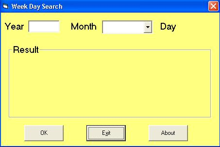



## Weekday Search

### Description

This program is a look alike as a calendar but is can search a certain "Weekday" by inserting the day, month and year.
 
### More Info
 

             |
---                |---
**Submitted On**   |2004-05-18 20:36:20
**By**             |[Yu Jiunn Shyang](https://github.com/Planet-Source-Code/PSCIndex/blob/master/ByAuthor/yu-jiunn-shyang.md)
**Level**          |Beginner
**User Rating**    |5.0 (10 globes from 2 users)
**Compatibility**  |VB 6\.0
**Category**       |[Math/ Dates](https://github.com/Planet-Source-Code/PSCIndex/blob/master/ByCategory/math-dates__1-37.md)
**World**          |[Visual Basic](https://github.com/Planet-Source-Code/PSCIndex/blob/master/ByWorld/visual-basic.md)
**Archive File**   |[Weekday\_Se1747325182004\.zip](https://github.com/Planet-Source-Code/yu-jiunn-shyang-weekday-search__1-53878/archive/master.zip)

